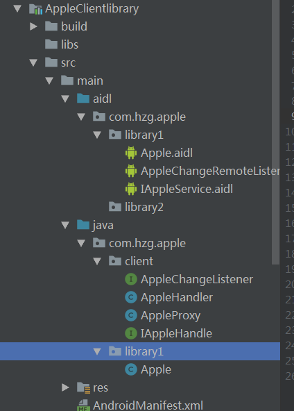
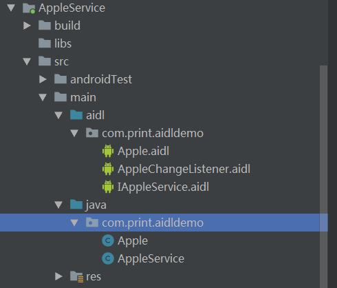

# AIDLDemo
该工程是关于aidl使用的demo，当前工程一共5个module

>其中Appleservice与appleclient是基础的aidl使用，aidl文件都分别写在了服务端和客户端上

客户端：

服务端：

请注意，服务端和客户端上的adil文件存放位置需是同一包名下...

>而Appleservice2,AppleClientlibrary与aidlwithlibrarydemo是一起的，而现在的adil是以一个libray的形式存放着
>并提供给Appleservice2依赖，而AppleClientlibrary中也编写了客户端的api，可以将这个AppleClientlibrary打成jar包
>提供给外部使用。

好处：

1.aidl文件不用编写两份，减少移动代码时，因包名不同产生的错误

2.可以将多个不同功能的aidl文件整合到一起一个jar中，提供给外部使用。多个功能时可以使用门面模式，提供不同功能的api类

